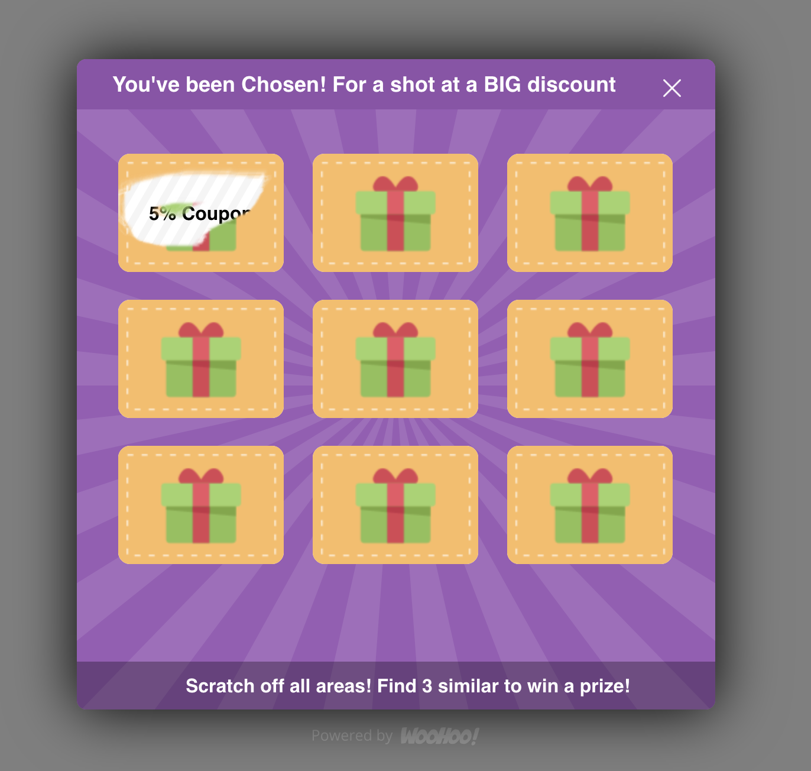

Это чисто исторический раздел где показано как приложение выглядело в самом начале
и по мере развития как его внешний вид выглядел.

# Виджеты

### Скрытые

Были приостановлены:
- gift;
- coupon;
- slot;
- wheel.

  
coupon, gift, slot

  &nbsp;
  &nbsp;
  

Мной разрабатывался ещё один из вариантов "игры", который не вышел в прод - scratch.

  
scratch

      

### Инструкция

Есть возможность их создать по ссылке:

- https://app.getwoohoo.com/#add/gift
- https://app.getwoohoo.com/#add/coupon
- https://app.getwoohoo.com/#add/slot
- https://app.getwoohoo.com/#add/wheel

Инструкция по созданию:
1. Войти на сайт app.getwoohoo.com под своим логином или авторизоваться через Shopify.
2. Ссылку выше вставить в строку браузера;
3. Нажать на Enter;
4. Нажать на кнопку "Перезагрузить страницу" () в браузере.

Некоторые элементы интерфейса, неподдерживаемых виджетов, в редакторе могут не работать.