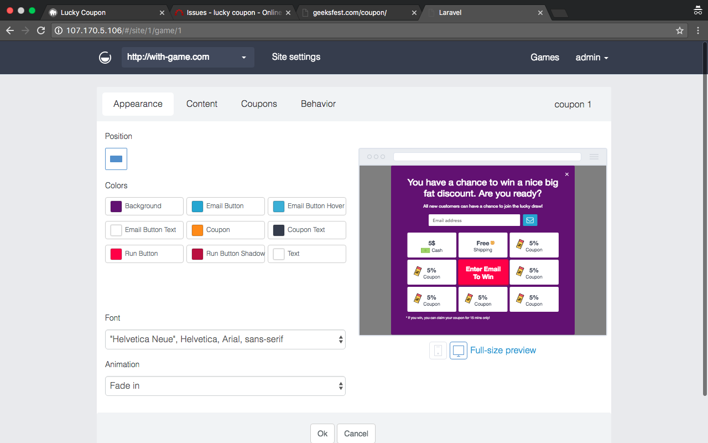
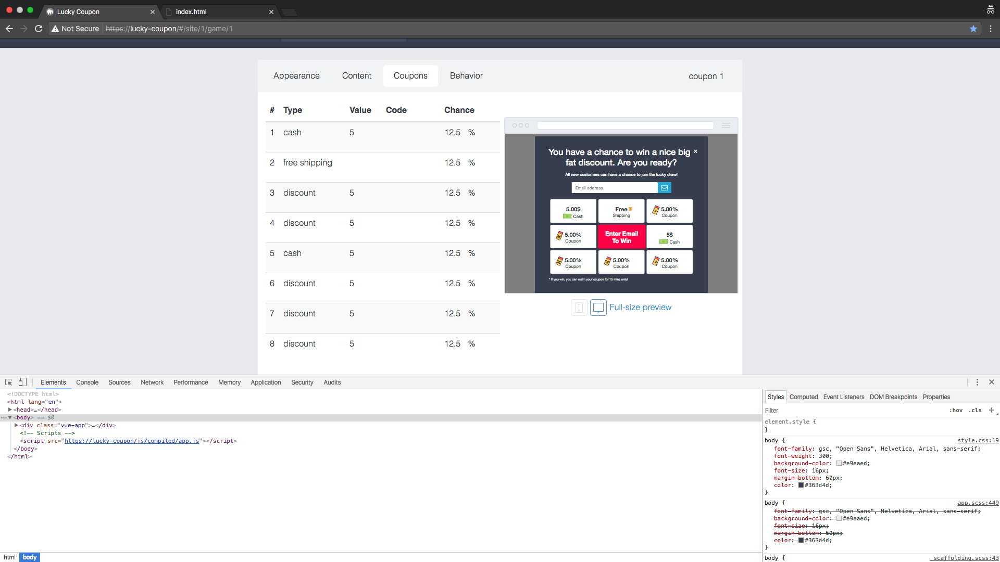
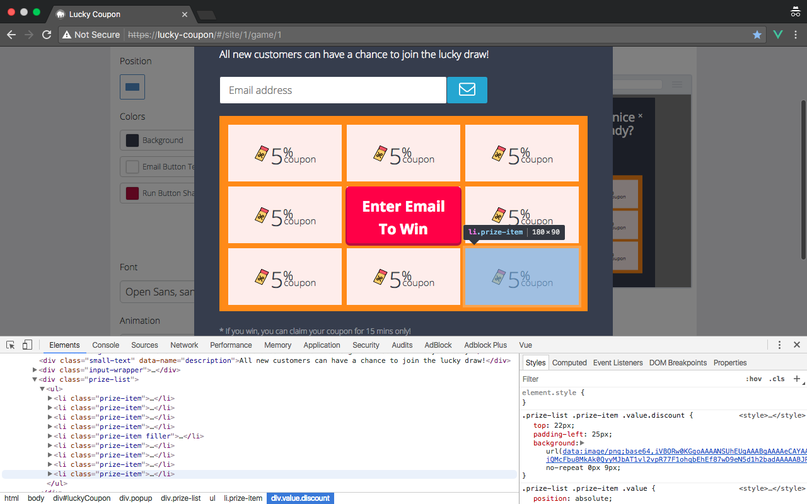
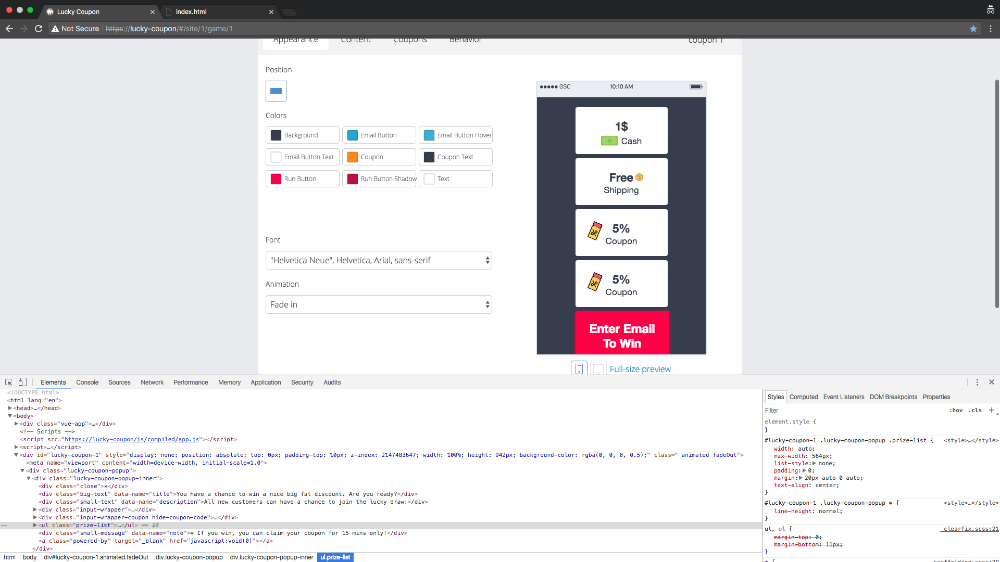
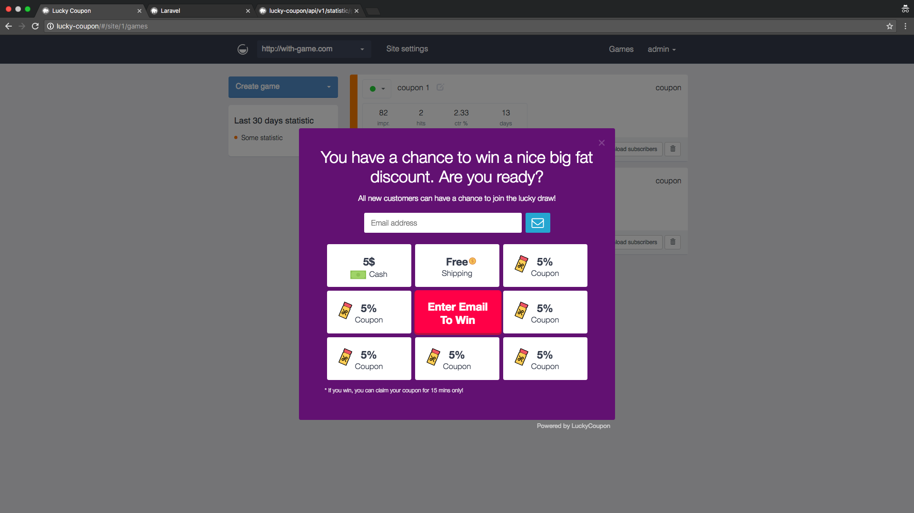
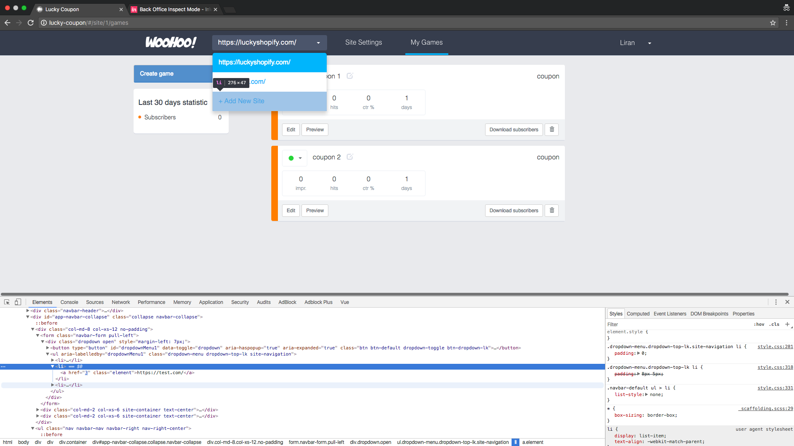
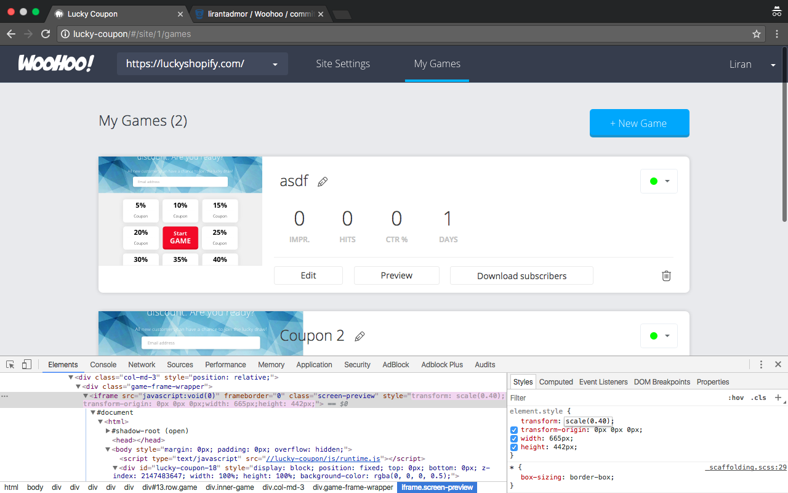
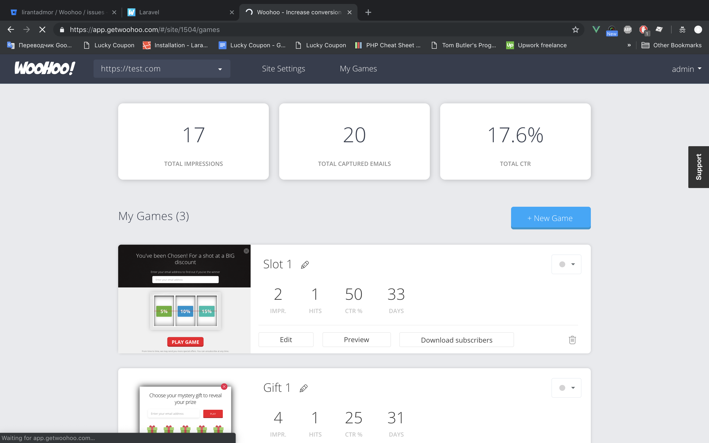

Исторический раздел, где показано как приложение выглядело в самом начале
и по мере развития как app.getwoohoo.com выглядел.

### Старый редактор

Первая версия вёрстки была вдохновлена другим проектом, который предоставлял
схожие услуги.

    
Старый редактор

    
    
    
    

    
Превью игры на старой панели управления

    

    

        Плавное изменение от первой версии вёрстки ко второй на примере страницы "игры".
        Шапка приложения уже умеет другой вид.
    

    &nbsp;
    &nbsp;
    

# Виджеты

### Скрытые

Были приостановлены:
- gift;
- coupon;
- slot;
- wheel.

  
coupon, gift, slot

  &nbsp;
  &nbsp;
  

Мной разрабатывался ещё один из вариантов "игры", который не вышел в прод - scratch.

  
scratch

      

### Инструкция

Есть возможность их создать по ссылке:

Инструкция по созданию:
1. Войти на сайт app.getwoohoo.com под своим логином или авторизоваться через Shopify.
2. Ссылку выше вставить в строку браузера;
3. Нажать на Enter;
4. Нажать на кнопку "Перезагрузить страницу" () в браузере.

Ссылки на скрытые виджеты:
- https://app.getwoohoo.com/#add/gift
- https://app.getwoohoo.com/#add/coupon
- https://app.getwoohoo.com/#add/slot
- https://app.getwoohoo.com/#add/wheel

Некоторые элементы интерфейса, неподдерживаемых виджетов, в редакторе могут не работать.