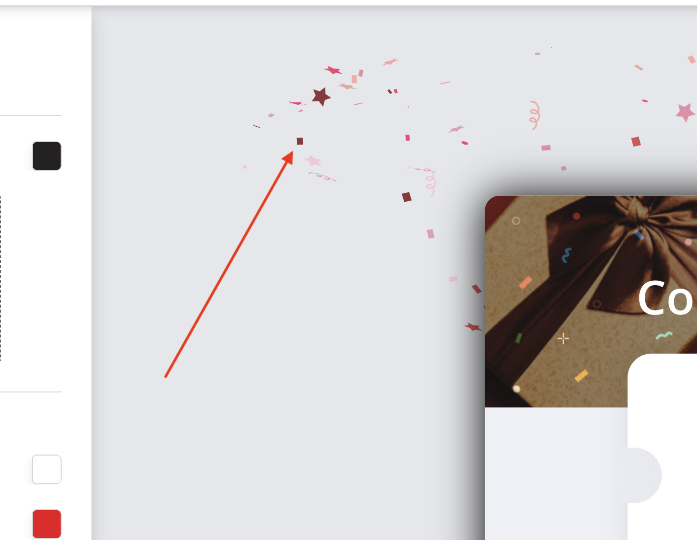

Здесь собран мой не полный опыт, но те вопросы, которые появлялись у HR. 
В статье исправляются ошибки, дополняются недостающие разделы. Вся
история изменений доступна тут на github.

# Общие сведения

https://app.getwoohoo.com  

Я являлся главным разработчиком приложения с 2017 по 2025 год. Весь нижеописанный функционал был
сделан мной, кроме исключений, которые я описал в разделе [Детали](#детали). Часть из работ, 
которые реализованы не мной, встречается по ходу текста и явно обозначены. Например, в разделах
[Варианты виджета](#варианты-виджета), описание вёрстки в [Frontend](#frontend).

Текст ниже не является полной историей разработки приложения, т.к. не было затронута большая часть
устаревших функций, таких как API валидации номеров/почты, интеграции покупки отдельных пакетов
планов через Shopify, отдельных веток проекта, противостоянию атак с целью взлома, засорения данных,
добавление Shopify расширения, написания интеграций для отдельных клиентов.

В качестве примера кода из приложения я привожу компонент работы с различными API. Хотя я не считаю
его идеальным, но компонент был написан достаточно абстрактно, что бы несколько программистов смогли с ним
разобраться без документации и добавить свои интеграции. Потраченный день на организацию этого компонента 
окупился. И, по-хорошему, нужно было потратить ещё немного времени, что бы будущие интеграции делались 
быстрее, проще. Но это я знаю сейчас, когда приложение работает и приносит прибыль.

### Термины

Под "игрой" я подразумеваю виджет со случайным выбором купона.

# Разработка

### Список разработчиков
- Я - 3730 коммитов.
- 716 коммитов - Лиран.
- 141 коммит - Вадим.
- 100 коммитов - Хасмик.
- 77 коммитов - Мехул.
- 51 коммит - Владислав.
- 9 коммитов - Адир.
- 8 коммитов - Сона.
- 6 коммитов - Сергей.

### Хронология

В первой версии был ровно один вариант виджета с "игрой", минимальная интеграция
с Shopify для генерации купонов и поддержка отправки купона по почте через SendGrid API.

Проект разрабатывался с апреля 2017 и единственным программистом там был я до 2019. Я добавлял
новые API такие, как: Shopify, Mailchimp, Klaviyo, Omnisend, Isracard, Fingerprint, IP-API, Cloudflare,
TheChecker, ChatChamp. Столкнулся с масштабированием проекта для клиента с посещением 2 млн. уникальных 
пользователей в месяц.

С июня 2019 по ноябрь 2019 я был занят разработкой couponzone.app.

C декабря 2019 по август 2020 я был занят разработкой hype.getwoohoo.com.

С 2019 года по 2022 владелец нанимал программистов. Одновременно в этот период работало не больше 2
программистов одновременно - я и один из нижеследующих. Тут успели поработать Влад, Михул, Сергей,
Вадим, Сона и ещё пара программистов/верстальщиков.

С 2020 года по 2025 на повестке были большие задачи, между которыми меня перекидывали
на оптимизацию виджета на frontend, на новые фичи, на исправления багов, в том числе большого скачка
в активности пользователей в конце 2022 из-за чего за месяц перед новым 2023 годом приложение
было в состоянии когда оно плохо работает, падает на некоторых запросах. В течении полугода
я занимался профилированием Mysql и redis, закрытием части тех долга, изменением части логики в связи
с переездом на CDN.

Одна из двух больших задач - это новый редактор - исследовательская задача для меня. Вторая задача - это новый
функционал для пользовательского интерфейса в виде фильтрации статистики по сайтам, играм, дням.
Сложность этой задачи заключалась в том, что статистика накопленная в mysql для посещений составляла 
500 миллионов записей. Количество отправленных пользовательских данных больше 50 миллионов записей.

### Детали

В разное время количество работающих человек вместе с программистами/верстальщиками
известных мне было от четырёх до шести.

Количество коммитов, которые я сделал для этого проекта - 3730. Количество отработанного времени
в этом проекте за 8 лет 3 месяца - 11 953 часов 28 минут, использовался трекер TopTal.

Владелец - Лиран, в прошлом верстальщик, добавил 716 коммитов за время проекта с
учётом версии лендинга в основном репозитории. Над лендингами работал Лиран, позже версия 
в репозитории была заменена на другой. Моя вёрстка в приложении работала, но Лиран
мог делать вёрстку привлекательной. Лиран правил в вёрстке какие-то крайние случаи
с отдельными устройствами или браузерами.

Все коммуникации не технического характера, договор, общение, решение финансовых вопросов 
с владельцем осуществлял Олег. Олег - мой товарищ по университету, мы учились вместе
в СевКавГТУ(известный сейчас как СКФУ) 5 лет. Он позвал меня работать вместе с ним
в 2016 году. В 2016 был совсем другой проект, с другим фреймворком и описывать
тот проект здесь не буду.

Следующий по количеству коммитов - программист Вадим, который в репозитории оставил 141 коммит.
Большая часть из них не попала в прод. Обновления версий ПО: Laravel, Vue, php, Mysql - Лиран 
по какой-то причине не одобрил. Его работа, которая попала в прод, заключалась в интеграции Jilt 
API. Лиран решил отключить эту интеграцию. Была ещё работа связанная с интеграцией Shopify, но 
она была не закончена.

Сергей делал интеграцию с ZappierApp, ActiveCampaign.

Владислав сделал функционал расширенного триального периода для пользователя, т.к. некоторым 
пользователям не хватало стандартного. Владислав не успел начать заниматься новым 
приложением - couponzone.app, владелец с ним расстался. Этот проект перешёл ко мне.

Мехул сделал один из вариантов кнопки открытия виджета и один вариант "игры"(fullwheel) в виджете.
Мехул занимался внедрением оплаты в hype.getwoohoo.com.

Хасмик сделала интеграцию с CampaignMonitor. Из того что не попало в прод была небольшая задачка
в админке, из-за "тяжёлого" запроса. И задача по добавлению фильтров на страницы со статистикой.

Адир - друг владельца, который модифицировал вёрстку шаблона виджета через Bitbucket.

Был один из программистов, который сделал конфетти. Они выбрасывались в конце игры на финальном экране.

  
Конфетти

  

### Backend

По-мимо общей схемы приложения, я проектировал базу данных. Да, не по советам Роберта Мартина,
где база - это всего лишь деталь реализации, а по советам моих преподавателей в университете, 
которые говорили, что смена базы данных - это явление крайне редкое и на практике лучше строить 
свою информационную систему вокруг хорошо спроектированной базы данных. В моём случае совет 
преподавателей по АСОиУ и СУБД оказался полезен. Мой кейс разработки с фокусом на базу оказался
подходящим выбором.

Проект ждало неизвестное будущее и многие вещи в базе были спроектированы
без планов на годы вперёд. И к очередному наплыву пользователей одну таблицу статистики я разделил
на две из-за размеров данных. И это по большому счёту единственный раз когда пришлось делать 
работу над ошибками. Эти таблицы составляют основную массу данных 500 млн. и 50 млн. строк данных.

### Frontend

Первая версия дизайна была свёрстана мной по скриншотам пока Лиран искал дизайнера. На мне
была Интеграция вёрстки с vue шаблонами, редактор, который через хуки изменял внешний вид
виджета в реальном времени. По мере готовности нового дизайна я перевёрстывал некоторые
элементы, а Лиран делал его привлекательнее (тени, transition). Текущий дизайн проекта
был свёрстан отдельным верстальщиком, которого нашёл Лиран. Моя работа заключалась в
том, чтобы интегрировать во вторую версию вёрстки логику vue и js редактора виджета,
которую я же и писал до этого.

# Приложение

Сайт представляет собой SPA приложение.

### Структура

Страницы:
- список созданных кампаний;
- список сайтов;
- аккаунт;
- интеграции;
- выбор виджета;
- редактор виджета;
- аффилированные пользователи;
- логин/регистрация пользователя;
- статистика показов/использованных купонов;
- выбора плана.

Административные страницы:
- список обычных магазинов и Shopify;
- магазины остановившие подписку;
- магазины использующие триальную версию;
- купленные планы;
- статус очередей.

Функционал:
- компонент предпросмотра виджета в приложении;
- компонент встраивания виджета на сторонний сайт;
- js логика виджета для редактора и стороннего сайта;
- API сбора и отправки данных.

Компоненты виджета:
- кнопка запуска основного окна;
- генерации шаблона основного окна;
- обработки данных "игры";
- отдельных "игр";
- отчёта обратного времени.

### Редактор

Пользователь имеет возможность изменять цвета формы, кнопок, шрифты, текст, создавать купоны, сложные настройки
условий и фильтров по которым появляется виджет, настройка кнопки триггера. Все эти данные храняться в MySQL.
В зависимости от виджета есть разные задачи, которые запускаются фоном, для сохранения картинки
и скрипта на CDN, обновления ссылок для части магазинов.

### Принцип работы виджета

После действия пользователя(кнопка старт) происходит анимация случайного выбора. В действительности
логика выбора купона происходит в пару тактов процессора основываясь на псевдослучайном генераторе от 0 до 1.
Каждый вариант купона настраивался со своим кодом купона(может быть пустым). Вероятность выпадения
высчитывается на основе параметра gravity, в зависимости от того какой gravity был присвоен другим купонам.

### Варианты виджета

В разное время было доступно разное количество виджетов. На момент написания доступно три виджета:
- spinthewheel;
- reveal;
- fullwheel;

  
spinthewheel, reveal, fullwheel

  
  
      

Были приостановлены:
- gift;
- coupon;
- slot;
- wheel.

Инструкция как посмотреть на [скрытые виджеты](#скрытые-виджеты) в приложении.

  
coupon, gift, slot

  
  
      

Из этих семи "игр" шесть были сделаны мной, fullwheel скопирован Мехулом на основе spinthewheel.

Прообразом spinthewheel и fullwheel был виджет с названием wheel. Поддержка виджета 
wheel была приостановлена.

Мной разрабатывался ещё один из вариантов "игры", который не вышел в прод - scratch.

  
scratch

      

### Архитектура

Структура приложения:  

Код самого приложения:  

Код компонента выглядит вот так: 
    
или например вот так: 

На момент старта приложения я был вдохновлён идеями Роберта Мартина и мне хотелось делать
понятную, выразительную архитектуру. Хотя у меня было немного времени для следования всем
принципам чистой архитектуры. Я выбрал ключевые, как мне показалось на тот момент. Я думал, что
смогу привести любой код в порядок потом. Из-за природы стартапа мне не всегда удавалось
следовать трём правилам - сделай что бы работало, сделай код понятным, сделай его быстрым, из-за
нехватки времени.

Вследствие чего мои архитектурные решения взяли крен в сторону более простой и понятной для 
организации слоистой архитектуры. Поэтому в проекте можно встретить такие места в которых 
абстрактные, концептуальные классы смешанны с конкретными реализациями:  

Изначально, я не предполагал, что выйдет долгая продуктовая разработка, потому что не понятно было, сможет
приложение выжить или нет. Решения принимались исходя из ресурсов. Сейчас я понимаю, что внедрение DDD на этом
проекте было проблематично, и усложнение кода за счёт выделения бизнес логики замедлило бы
разработку на начальном этапе. Отсутствие DDD диктовалось условиями на предоставление быстрых результатов.
В короткой перспективе это сработало хорошо. На долгосрочном горизонте быстрый старт был скомпенсирован
количеством разработчиков прошедших проект.

### Сервера

В первых версиях работающего приложения nginx, php, mysql располагались на одном единственном сервере.
Сейчас это отдельные сервера: load balancer, php-fpm, redis, mysql, CDN. Есть возможность развернуть
множество php-fpm серверов для масштабирования обработки запросов.

### Обновления ПО

На сколько я помню единственным обновлением софта было обновление php версии с 5.6 на 7.2.
Обновление производилось мной когда было два сервера: php и mysql.

### Скрытые виджеты

В следствии изменения некоторые виджеты были скрыты. Не все функции этих "игр" остались 
рабочими, и какие-то элементы в редакторе не работают. Есть возможность их создать по ссылке:

- https://app.getwoohoo.com/#add/gift
- https://app.getwoohoo.com/#add/coupon
- https://app.getwoohoo.com/#add/slot
- https://app.getwoohoo.com/#add/wheel

Инструкция по созданию:
1. Войти на сайт app.getwoohoo.com под своим логином или авторизоваться через Shopify.
2. Ссылку выше вставить в строку браузера;
3. Нажать на Enter;
4. Нажать на кнопку "Перезагрузить страницу" () в браузере.

### Репозиторий

Некоторые пакеты для нового редактора можно найти у меня на [github]
- [js-class-parser] - основной пакет для dependency injection container;
- [css-vars-extractor] - экстрактор переменных из файлов стилей;
- [shadow-dom] - класс-обёртка для работы с Shadow dom;
- [html-manipulator] - обёртка по работе с преобразованием объектов в HTML элементы.

[github]: https://github.com/nonick891
[js-class-parser]: https://github.com/nonick891/js-class-parser
[css-vars-extractor]: https://github.com/nonick891/css-vars-extractor
[shadow-dom]: https://github.com/nonick891/shadow-dom
[html-manipulator]: https://github.com/nonick891/html-manipulator