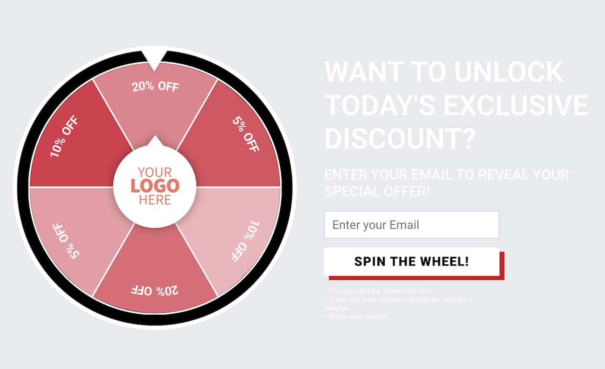
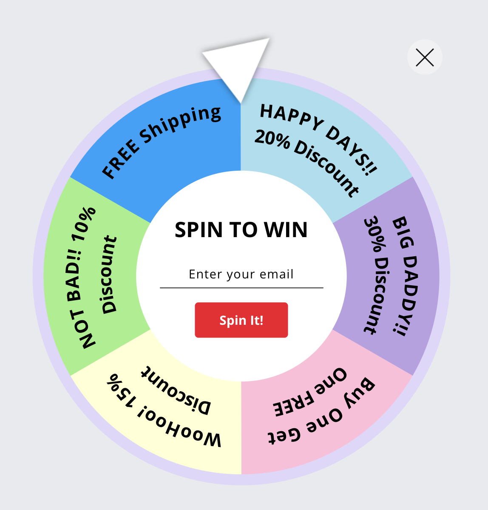
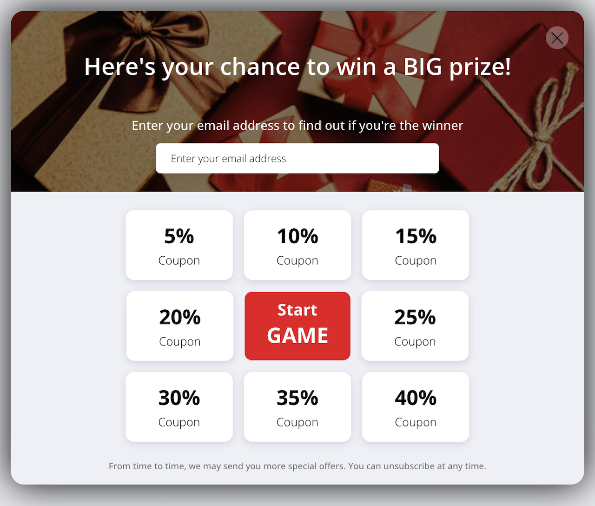
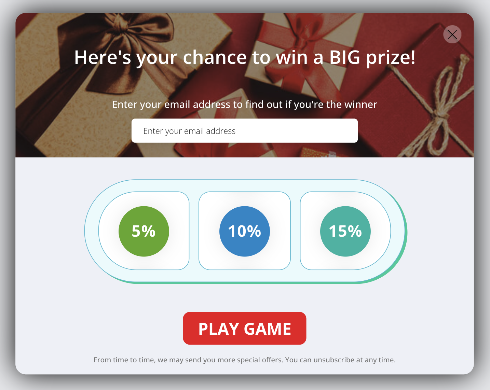
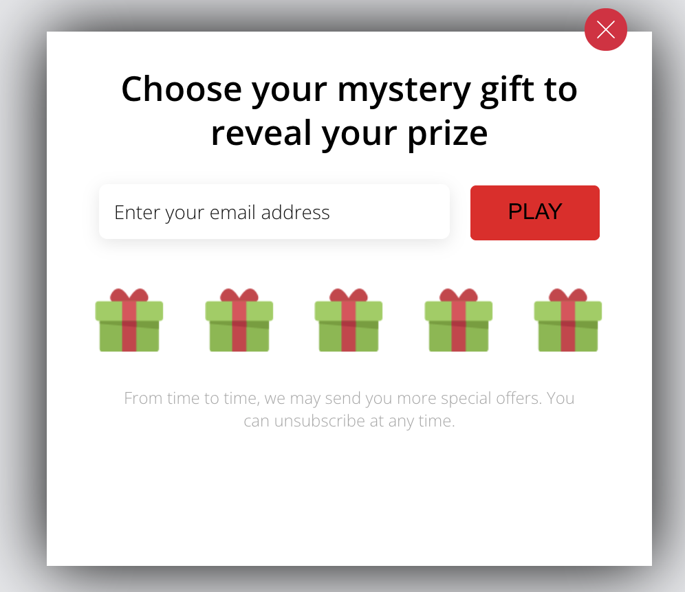
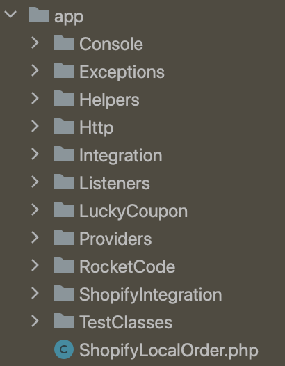
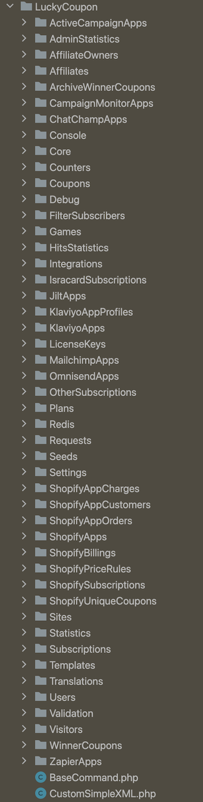
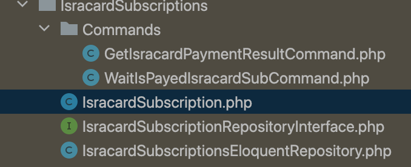
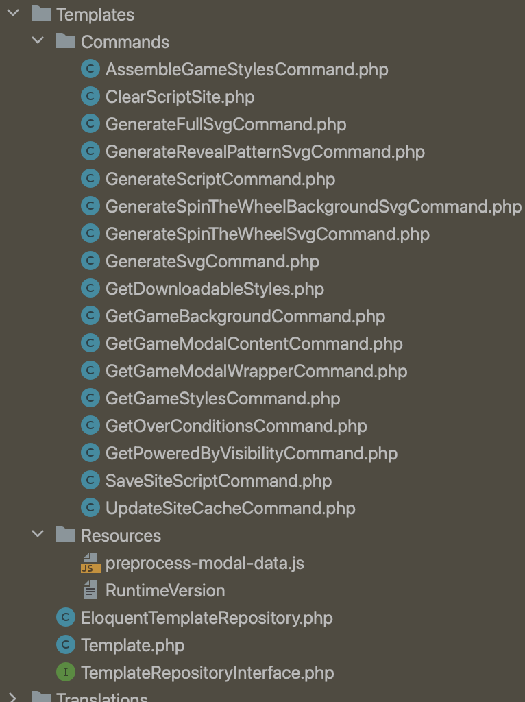
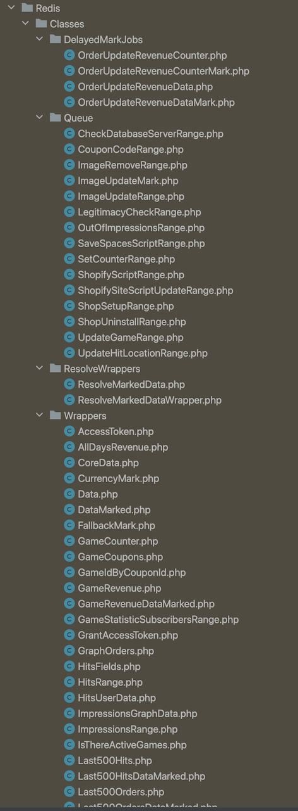

# Общие сведения
https://app.getwoohoo.com  
Весь нижеописанный функционал был сделан мной. Некоторые исключения я описал в разделе Разработка.
Часть из функционала, который реализован не мной встречается по ходу текста и явно обозначен.

Текст ниже не является полной историей разработки приложения, т.к. не было затронута большая часть
устаревших функций, таких как API валидации номеров, интеграции покупки отдельных пакетов планов через Shopify,
отдельных веток проекта, противостоянию атак с целью взлома, засорения данных, добавление Shopify расширения.

В качестве примера кода из приложения я привожу компонент работы с различными API. Хотя я и не считаю
его идеальным, но он был написан достаточно абстрактно, что бы несколько программистов смогли с ним 
разобраться без документации и добавить свои интеграции.

### Разработка

Количество коммитов, которые я сделал для этого проекта - 3730. Количество отработанного времени
в этом проекте за 8 лет 3 месяца - 11 953 часов 28 минут и это только те часы, что я трекал в TopTal.

Владелец - Лиран, в прошлом верстальщик, добавил 716 коммитов за всё время жизни проекта даже с 
учётом того что в какой-то момент одна из версий лендинга появилась в основном репозитории.
Над лендингом работал в основном Лиран. Моя вёрстка в приложении работала, но Лиран 
мог делать вёрстку привлекательной. Лиран правил в вёрстке какие-то крайние случаи с отдельными 
устройствами или браузерами.

Следующий по количеству коммитов программист - Вадим, который в репозитории оставил 141 коммит. 
Большая часть из них не попала в прод, обновления Laravel, Vue, php, Mysql - Лиран по какой-то причине не одобрил. 
Его работа, которая попала в прод, заключалась в интеграции Jilt API. Лиран - владелец бизнеса, решил отключить эту интеграцию.

Хасмик сделала интеграцию с CampaignMonitor.

Сергей делал интеграцию с ZappierApp, ActiveCampaign.

Мехул сделал один из вариантов кнопки открытия виджета и один вариант "игры"(fullwheel) в виджете.

Владислав сделал функционал расширенного триального периода для пользователя, т.к. некоторым не хватало стандартного.

Был один из программистов, который сделал конфетти. Конфетти выбрасывались в конце игры на финальном экране.

Список разработчиков, которые вносили изменения:
- Я 3730 коммитов.
- 716 коммитов Лиран.
- 141 коммит Вадим.
- 100 коммитов - Хасмик.
- 77 коммитов Мехул.
- 51 коммит Владислав.
- 9 коммитов Адир.
- 8 коммитов Сона.
- 6 коммитов Сергей.

### Приложение

Сайт представляет собой SPA приложение. Первая версия дизайна была свёрстана мной по
скриншотам с другого проекта пока Лиран искал дизайнера. Интеграцию вёрстки с vue шаблонами,
редактор который через хуки изменял внешний вид виджета в реальном времени. По мере готовности
нового дизайна я перевёрстывал некоторые элементы, Лиран делал привлекательнее (тени, transition).

### Принцип работы виджета

После действия пользователя(кнопка старт) происходит анимация случайного выбора. В действительности
логика происходит в пару тактов процессора основываясь на псевдослучайном генераторе от 0 до 1.
Каждый вариант купона настраивался со своим кодом купона(может быть пустым), вероятностью выпадения,
она высчитывалась на основе параметра gravity в зависимости от того, что было присвоено другим вариантам.

### Варианты виджета

В разное время было доступно разное количество виджетов. На данный момент доступно 3 виджета:

- spinthewheel;
- reveal;
- fullwheel;

  
spinthewheel, reveal, fullwheel

  
  
      

Были отключены:
- gift;
- coupon;
- slot.

  
coupon, gift, slot

  
  
      

Из этих шести игр 5 были сделаны мной, один из них сделал Мехул - это fullwheel.

Мной разрабатывался один из вариантов виджета, который не вышел в прод - scratch.

### Функции редактора

Пользователь имеет возможность изменять цвета формы, кнопок, шрифты, текст и сохранял. Все эти данные отправляются
на сервер и сохраняются в MySQL.

### Хронология

Первая версии был ровно один виджет с "игрой", минимальная интеграция
с Shopify для генерации купонов и поддержка отправки почты через SendGrid API. Под "игрой"
я подразумеваю виджет со случайным выбором купона из списка.

Проект разрабатывался с апреля 2017 и единственным программистом там был я до 2019. Я добавлял
новые API такие как: Shopify, Mailchimp, Klaviyo, Omnisend, Isracard, Fingerprint, IP-API, Cloudflare,
TheChecker, ChatChamp. Столкнулся с масштабированием проекта для клиента с 2 млн. уникальных пользователей.

С 2019 года по 2022 владелец нанимал программистов. Одновременно в этот период работало не больше
2 программистов одновременно. Тут успели поработать Влад, Михул, Сергей, Вадим, Сона и ещё пара программистов.

С 2020 года по 2025 я занимался двумя большими задачами, между которыми меня перекидывали
на оптимизацию виджета на frontend, на новые фичи, на исправления багов, в том числе большого скачка
в активности пользователей в конце 2022 из-за чего за месяц перед новым 2023 годом приложение
было в состоянии когда оно плохо работает, падает на некоторых запросах. В течении полугода
я занимался тюнингом Mysql и redis, закрытием части тех долга.

Одна тех двух больших задач это новый редактор - исследовательская задача для меня. Вторая задача - это новый
функционал для пользовательского интерфейса в виде фильтрации статистики по сайтам, играм, дням.
Сложность этой задачи заключалась в том что статистика накопленная в mysql для посещений уже
составляет 500 миллионов записей. Количество отправленных пользовательских данных примерно 10% от этой.

Некоторые пакеты для нового редактора можно найти у меня на [github]

### Архитектура

Архитектуру приложения закладывал я. На данный момент структура проекта выглядит вот так:  

Код самого приложения:  

Код компонента выглядит вот так: 
    
или например вот так: 

На момент старта приложения я был вдохновлён идеями Роберта Мартина и мне хотелось делать
понятную, выразительную архитектуру. Хотя у меня было немного времени для следования всех
принципов чистой архитектуры я выбрал ключевые, как мне казалось на тот момент. Я думал что
смогу привести любой код в порядок, но из-за природы бизнес-стартапа мне не всегда удавалось
сделать код простым понятным и читаемым, а архитектуру выразительной.

Вследствие чего мои архитектурные решения взяли крен в сторону более простой и понятной слоистой
архитектуры для организации. Поэтому в проекте можно встретить такие места в которых абстрактные,
концептуальные классы смешанны с конкретными реализациями:  

### Структура

Страницы, функционал, которые были сделано мной:
- список созданных кампаний;
- список сайтов;
- страница аккаунта;
- страница интеграций;
- страница выбора виджетов;
- страница редактора виджета;
  - предпросмотр виджета на странице выбора виджетов;
  - система встраивания виджета на сторонний сайт;
  - js логика встраиваемого виджета;
  - сбор статистики виджета;
- страница аффилированных пользователей по приглашению;
- страница логина/регистрации пользователя.

Виджет так же имеет различные компоненты:
- компонент отрисовки основного окна;
- компонент запуска основного окна;
- компонент процессинга входных данных;
- компоненты отдельных "игр";
- компонент отчёта обратного времени.

### Сервера

В первых версиях работающего приложения nginx, php, mysql располагались на одном единственном сервере.
Сейчас это отдельные сервера: load balancer, php-fpm, redis, mysql, CDN. Есть возможность развернуть
множество php-fpm серверов для масштабирования обработки запросов. И эту конфигурацию настраивал я.

### Обновления

На сколько я помню единственным обновлением софта было обновление php версии с 5.6 на 7.2
Обновление производилось тогда, когда было всего два сервера php и mysql.

### Скрытые виджеты

В следствии изменения некоторые виджеты были скрыты. Есть возможность их создать и ими воспользоваться по ссылке:

https://app.getwoohoo.com/#add/gift
https://app.getwoohoo.com/#add/coupon
https://app.getwoohoo.com/#add/slot

Не все функции этих "игр" остались рабочими, и какие-то элементы в редакторе не работают.

1. Ссылку вставить в строку браузера.
2. Нажать на Enter.
3. Нажать на кнопку "Перезагрузить страницу" в браузере.

[github]: https://github.com/nonick891